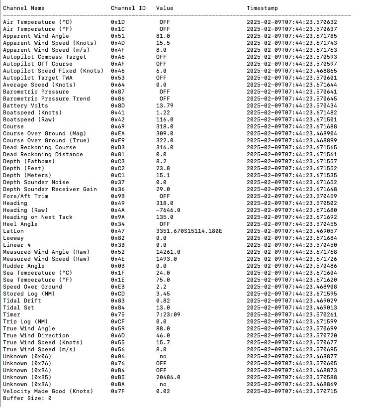

# fastnet2ip
Fastnet is the propriatory protocol used by B&G on some older instruments, tested on Hydra/H2000. It might work on other systems. I developed this for personal use and publishing for general interest only. 

This code listens for fastnet data on the bus, interprets the message and then broadcasts a UDP packet with the applicable NMEA sentence.

This is the companion app to the library [pyfastnet](https://github.com/ghotihook/pyfastnet)


## Installation

Fastnet uses two-wire differential transmission and I have had success using RS-485/CAN bus connections. The CAN Hat has the option to enable 120ohm teminations which I am using.

These are known to work
- [Waveshare RS485 CAN HAT](https://www.waveshare.com/wiki/RS485_CAN_HAT)
- [DTECH USB RS422/RS485 USB dongle](https://www.amazon.com.au/DTECH-Converter-Adapter-Supports-Windows/dp/B076WVFXN8)

Connections
- **Fastnet White**: RS485 Data +
- **Fastnet Green**: RS485 Data -
- **Baud Rate**: 28,800
- **Data Bits**: 8
- **Parity**: Odd
- **Stop Bits**: 2

I have been running on Rasperry Pi, a stock install is sufficient.

```pip3 install pyfastnet```

if using a Waveshare CAN HAT add this to /boot/firmware/config.txt

```dtoverlay=mcp2515-can0,oscillator=12000000,interrupt=25,spimaxfrequency=2000000```

I have found the USB dongle works out of the box.

## Running

**Virtual mode - txt file input**

```~/python_environment/bin/python3 fastnet2ip.py --file raw_fastnet_data.txt -u 2002 --log-level ERROR```

**Real mode - serial port input**

```~/python_environment/bin/python3 fastnet2ip.py --serial /dev/ttyUSB0 -u 2002 --log-level ERROR```

**Support NMEA messages**
- VHW (Boatspeed)
- DBT (Depth)
- RSA (Rudder Angle)
- XDR (Battery Voltage - Tagging = Main)
- MWD (True Wind Direction)
- MWD (True Wind Angle / Speed)
- MWV (Apparent Wind Angle / Speed)
- MTW (Sea Temperature)
- HDG (Heading)
- VTG (COG and SOG)
- GLL (Lat/Lon)
- Multiple XDR sentences including
	- Tide Drift
	- Tide Set
	- Measured Wind Angle (Raw)
	- Measured Wind Speed (Raw)
	- Battery Voltage

**Console output**




## Watchdog
If being run at startup, the fastnet2ip_wd.sh can be used as a robust way to keep it running executed from /etc/rc.local

## Approach
This is the approximate approach
- collect data from serial port or file buffer
- Add it to the queue for processing
- Retrive valid message from the queue (remaining partial data is left)
- Iterate through messages
	- Updating live_view
	- Trigger NMEA message sending
- Wait until more data is available on the input buffer


## Bench Testing
Record and playback of live data. I use this to capture live data from the boat so I can play it back offline for testing
- use record_fn.py to capture raw Fastnet data into a .txt file, no processing is done, it captures the raw data. To use this you will need to edit the serial port address in the .py file.
- Recorded data can be played back using fastnet2ip.py using the --file option

Given the differential nature of the connection, loopback if not feasable. Seperate transmit and receive ports required for physical bench testing.

## Acknowledgments / References

- [trlafleur - Collector of significant background](https://github.com/trlafleur) 
- [Oppedijk - Background](https://www.oppedijk.com/bandg/fastnet.html)
- [timmathews - Significant implementation in Cpp](https://github.com/timmathews/bg-fastnet-driver)
- Significant help from chatGPT!