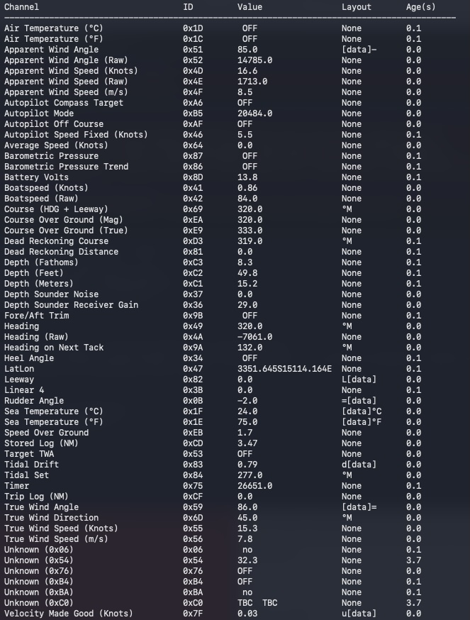

# fastnet2ip

Fastnet is the proprietary serial protocol used by B&G on older instruments (tested on Hydra/H2000). This application reads raw Fastnet data from a serial port, converts it to NMEA 0183 sentences, and broadcasts them over UDP — making older B&G instrument data available to modern chart plotters and navigation software.

## What this app does vs. the pyfastnet library

This repo is a ready-to-run application. It depends on [pyfastnet](https://github.com/ghotihook/pyfastnet) as its decoding engine.

**[pyfastnet](https://github.com/ghotihook/pyfastnet) handles the Fastnet protocol layer:**
- Frame synchronisation and boundary detection in the raw byte stream
- Checksum validation
- Decoding each frame into named instrument channels with interpreted values (e.g. `Apparent Wind Speed (Knots): 7.0`)

**This app (fastnet2ip) handles everything above that:**
- Reading bytes from a serial port or a recorded hex file
- Feeding bytes to pyfastnet and consuming its decoded channel queue
- Maintaining a live data store (most recent value per channel, with timestamp)
- Mapping each Fastnet channel to the correct NMEA 0183 sentence and formatting it
- Only broadcasting when a value changes, with a 5-second rebroadcast fallback for unchanged values
- UDP broadcast to the local network
- Systemd service integration for unattended operation


## Hardware

Fastnet uses two-wire differential transmission. RS-485 adapters work well; the CAN Hat option includes 120 ohm termination which is recommended.

**Tested hardware**
- [M5Stack Core MP135](https://shop.m5stack.com/products/m5stack-coremp135-w-stm32mp135d)
- [DTECH USB RS422/RS485 USB dongle](https://www.amazon.com.au/DTECH-Converter-Adapter-Supports-Windows/dp/B076WVFXN8) — works out of the box
- [Waveshare RS485 CAN HAT](https://www.waveshare.com/wiki/RS485_CAN_HAT) — add to `/boot/firmware/config.txt`:
  ```
  dtoverlay=mcp2515-can0,oscillator=12000000,interrupt=25,spimaxfrequency=2000000
  ```

**Wiring**

| Fastnet wire | RS-485 |
|---|---|
| White | Data + |
| Green | Data - |

**Serial settings**: 28,800 baud, 8 data bits, odd parity, 2 stop bits


## Installation

Tested on Raspberry Pi with a stock OS install.

```bash
pip3 install "pyfastnet>=2.0.1"
```

Or clone this repo and install dependencies:

```bash
pip3 install -r requirements.txt
```


## Running

**From a serial port (live data)**

```bash
python3 fastnet2ip.py --serial /dev/ttyUSB0 --udp-port 2002 --log-level INFO
```

**From a recorded hex file (simulation)**

```bash
python3 fastnet2ip.py --file test_files/example1_fastnet_data.txt --udp-port 2002 --log-level ERROR --live-data
```

**Command-line arguments**

| Argument | Default | Description |
|---|---|---|
| `--serial PORT` | — | Serial port (e.g. `/dev/ttyUSB0`) |
| `--file PATH` | — | Path to a recorded hex file |
| `--udp-port N` | `2002` | UDP broadcast port |
| `--log-level LEVEL` | `INFO` | `DEBUG`, `INFO`, `WARNING`, `ERROR`, `CRITICAL` |
| `--live-data` | off | Print a live data table to the console once per second |

NMEA sentences are broadcast to `255.255.255.255` on the specified UDP port.


## NMEA Output

| Sentence | Content |
|---|---|
| VHW | Boatspeed, magnetic heading |
| DBT | Depth below transducer |
| RSA | Rudder angle |
| HDM | Magnetic heading |
| MWD | True wind direction and speed |
| MWV | True wind angle/speed (ref T) |
| MWV | Apparent wind angle/speed (ref R) |
| MDA | Air temp, sea temp, barometric pressure |
| VTG | COG and SOG |
| VPW | Velocity made good |
| VDR | Tidal set and drift |
| GLL | Latitude/Longitude |
| XDR | Battery voltage, heel, fore/aft trim, raw wind speed, raw wind angle, raw boatspeed |

**Console output — `--live-data` flag**




## Systemd Service

A `fastnet2ip.service` file is provided for running at startup.

> **Note:** The service file defaults to `/dev/ttySTM3`. Update the `BindsTo=`, `After=`, and `ExecStart=` lines to match your serial port and installation path before deploying.

```bash
sudo cp fastnet2ip.service /etc/systemd/system/
sudo systemctl daemon-reload
sudo systemctl enable fastnet2ip
sudo systemctl start fastnet2ip
```


## Bench Testing Tools

The `tools/` directory contains utilities for capturing and replaying live Fastnet data offline.

**Record raw Fastnet data to file**

```bash
python3 tools/record_fn.py --port /dev/ttyUSB0 --output my_capture.txt
```

| Argument | Default | Description |
|---|---|---|
| `--port PORT` | `/dev/ttyAMA0` | Serial port to read from |
| `--baud N` | `28800` | Baud rate |
| `--output FILE` | `fastnet_record.txt` | Output file (hex format) |

**Play back a recording to a serial port**

Useful for testing with hardware that receives serial input. Note: due to the differential nature of the bus, a loopback is not feasible — separate transmit and receive ports are required for physical bench testing.

```bash
python3 tools/playback_fn.py --port /dev/ttyUSB1 --input my_capture.txt
```

| Argument | Default | Description |
|---|---|---|
| `--port PORT` | `/dev/ttyAMA0` | Serial port to write to |
| `--baud N` | `28800` | Baud rate |
| `--input FILE` | `fastnet_record.txt` | Hex file to play back |

Recorded files can also be played directly through the main decoder using `--file`.


## How It Works

```
Serial port / hex file
        │
        ▼
  pyfastnet FrameBuffer          ← byte sync, checksum, channel decoding
        │
        ▼
  Decoded frame queue            ← structured dicts: channel name + interpreted value
        │
        ▼
  Live data store                ← latest value + timestamp per channel
        │
        ▼
  NMEA sentence builder          ← one function per sentence type
        │
        ▼
  UDP broadcast 255.255.255.255
```

A sentence is sent when a channel value changes, or if the previous broadcast for that channel was more than 5 seconds ago (so downstream apps don't lose data during quiet periods).


## Acknowledgments

- [trlafleur](https://github.com/trlafleur) — collected significant background research
- [Oppedijk](https://www.oppedijk.com/bandg/fastnet.html) — protocol background
- [timmathews](https://github.com/timmathews/bg-fastnet-driver) — substantial C++ implementation
